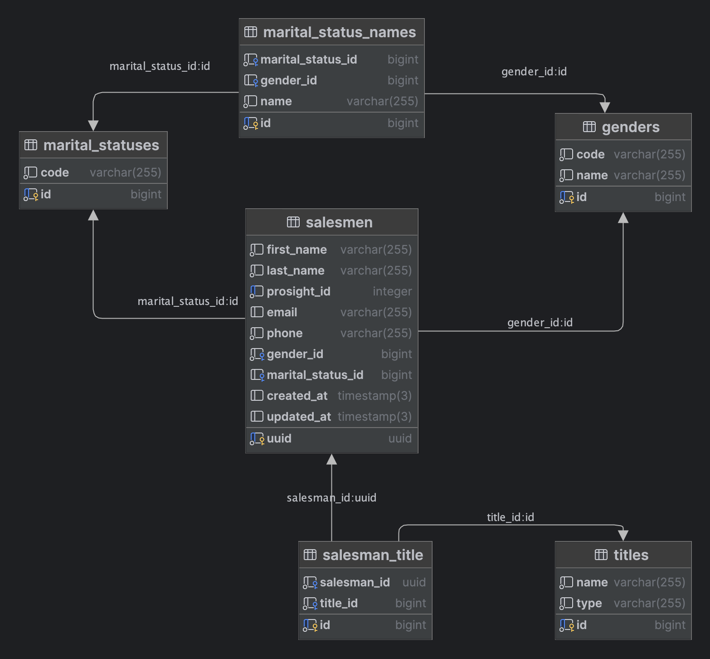

## Start containers

Start containers by running
```shell
 ./vendor/bin/sail up
```

## Salesmen import

Copy `salesmen.csv` file to `database/seed_data/salesmen.csv` 

Run DB migrations and seed the DB
```shell
./vendor/bin/sail artisan migrate
./vendor/bin/sail artisan db:seed
```

## DB schema


